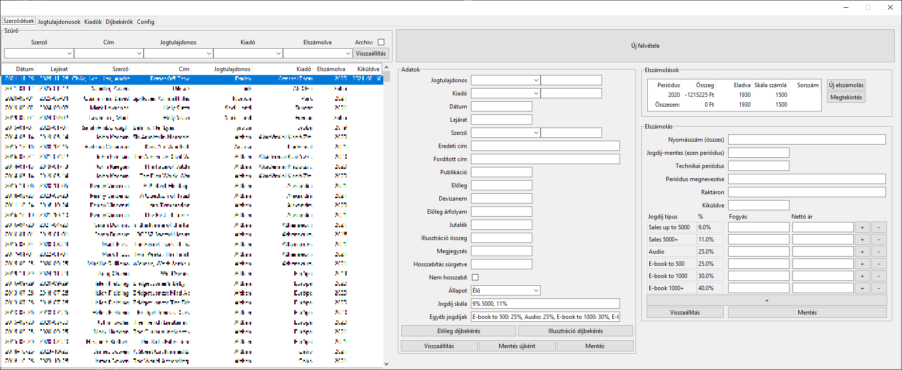
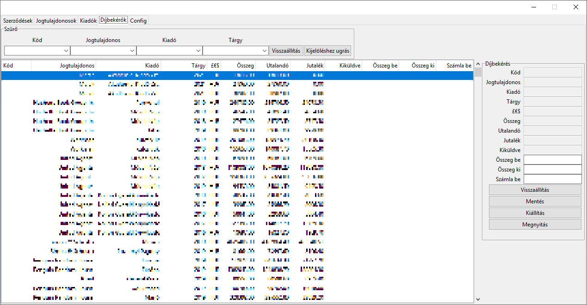
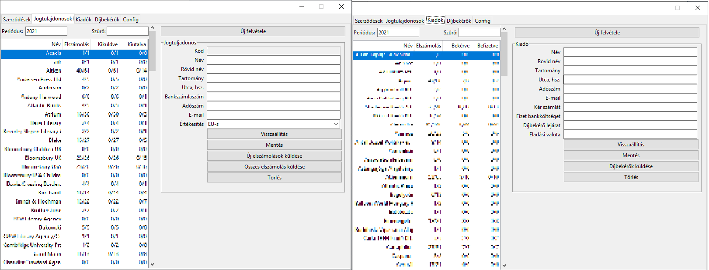

# CRUD app
* I developed this CRUD app in Python to allow employees to manage the MySQL database I designed for the company.
* It does contains some helpful calculation methods and allows them to export invoice and statements to pdf and send automatized emails.

